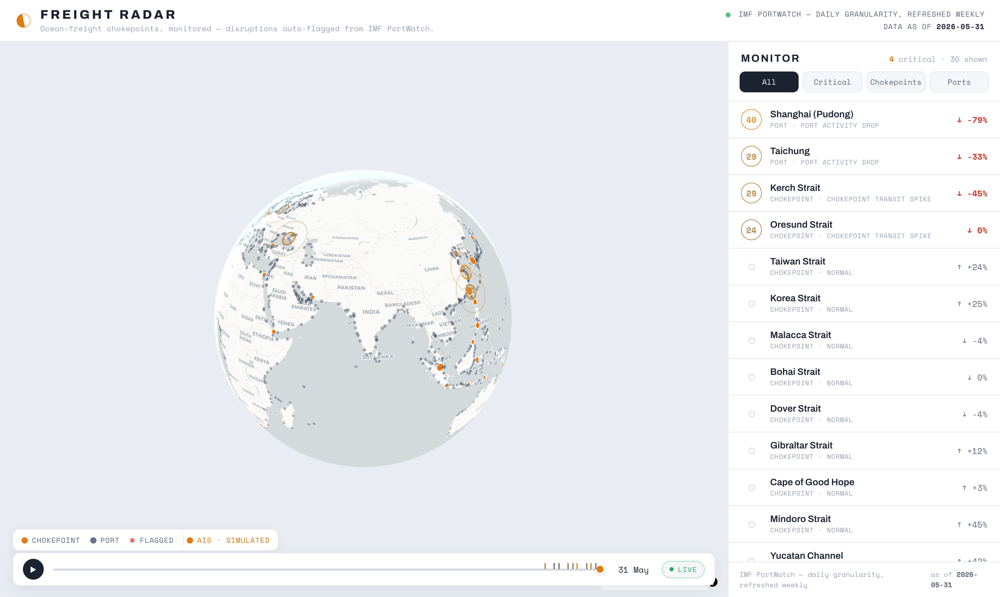
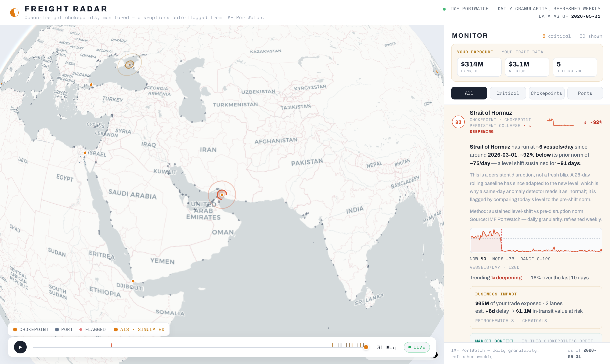
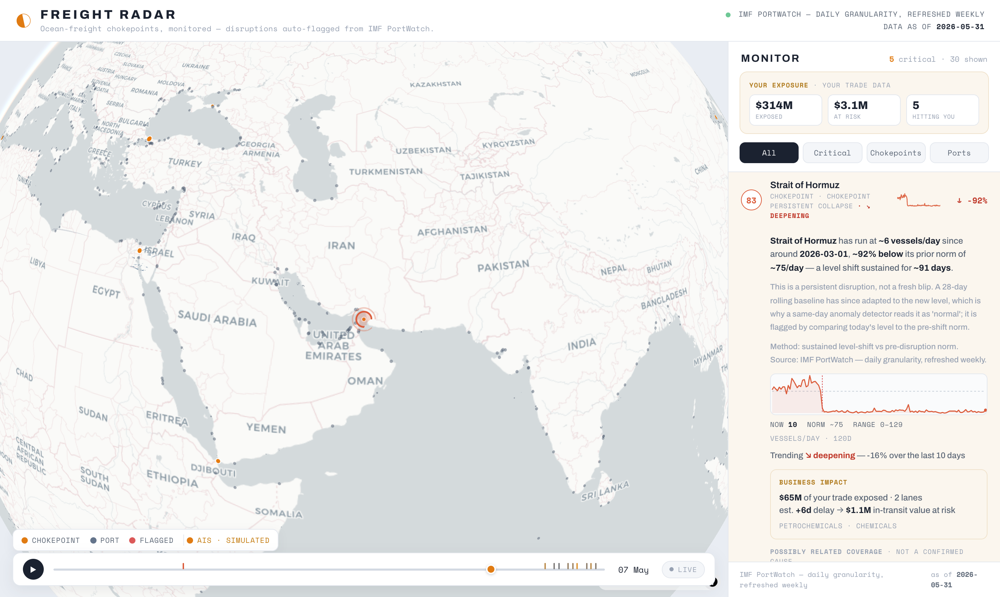
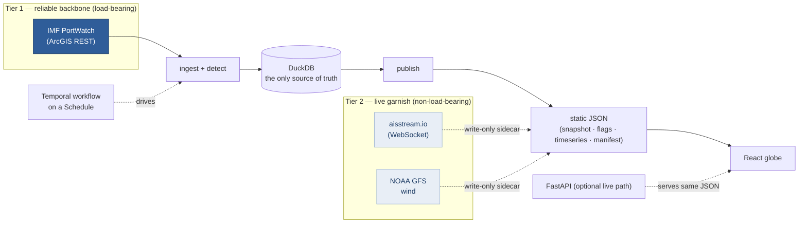

# Freight Radar

**An ocean-freight stress monitor on a 3D globe — 28 maritime chokepoints + ~2,000 ports, where a statistical engine auto-flags transit collapses, congestion, Cape-of-Good-Hope reroutes, and cargo-specific drops from free, public IMF PortWatch data. Every figure is computed in Python from source — no model is in the number path.**

[**▶ Live demo**](https://joshs444.github.io/freight-radar/) · [**How it stays honest** ↓](#how-it-stays-honest)

[](https://github.com/joshs444/freight-radar/actions/workflows/ci.yml)
[](https://github.com/joshs444/freight-radar/actions/workflows/deploy.yml)
[](frontend/scripts/check_chat.mjs)
[](LICENSE)



Every number traces back to source. Nothing is hand-waved — the stress index decomposes into its parts, the brief's figures are computed in Python (never by a model), and the chat will only state a number it can cite to a source file.

---

## What it is

The world's seaborne trade funnels through ~28 maritime chokepoints (Suez, Hormuz, Malacca, Panama, the Taiwan Strait…). When one seizes up, the shock ripples through supply chains weeks before it shows up in the financial press. Freight Radar watches all of them — plus ~2,000 ports — on a 3D globe, runs real change-point detection over the history, and surfaces only the disruptions that clear a statistical bar.

It's built on free, public **IMF PortWatch** data and a durable **Temporal** workflow, and it's scrupulous about saying only what the data supports.

| The whoa frame | A real detected flag | Replay the collapse |
|---|---|---|
|  |  |  |

- **Light globe** — MapLibre v5 native globe + deck.gl (interleaved) renders 28 chokepoints as crisp amber marks and ~2,065 ports sized into a hierarchy by real vessel traffic (big ports read first), plus sampled live AIS vessels and great-circle lane arcs. A **layer panel** toggles every overlay (ports / vessels / wind / storms / flags / lanes) with live counts, and answers honestly what the vessels are (a point-in-time AIS sample near the chokepoints, not all ships).
- **Filterable monitor feed** — every monitored chokepoint + flagged port, filterable to **All / Critical / Chokepoints / Ports**, sorted critical-first then by real traffic. Click any row → the globe flies to it and a plain-English brief expands with the *real* numbers ("Shanghai port calls fell to 18 on 2026-05-25, 79% below its 28-day norm, z = −7.1"). **Search** by name, country, or status (`country:japan`, `is:critical`) lights every match on the globe; hovering a row rings its mark.
- **Cargo-aware detection** — beyond the blended counts, the engine reads the per-cargo-type flows the warehouse already carries. A port's **dominant cargo stream** is detected on its own — so a brief reads *"Hong Kong container calls −38% (z −7.3), tanker +32%"* instead of a muddied total, surfacing moves a total-only view erases. Each chokepoint's **average vessel size** (transiting tonnage ÷ vessel count) is tracked as an axis **orthogonal to the count** (≈ −0.08 correlation), catching fleet-mix shifts the count can't see — e.g. *Yucatan Channel +34%, bigger ships, count flat*. Every row shows its **vessel mix**; chokepoints add avg vessel size + transiting tonnage.
- **National-dependence weighting** — each port carries its share of its *country's* maritime trade (an IMF systemic-importance score). A country's **sole gateway** (Mombasa ≈ 99.8% of Kenya's trade) now outranks an equally-busy port that is one of many — and a flagged systemic port says *"handles ~N% of {country}'s maritime imports"* on its brief, with a National-dependence chip in the row.
- **Global Ocean Freight Stress Index (0–100)** — one at-a-glance number in the top bar, with a 30-day sparkline and week-over-week momentum. It **blends breadth** (an economic-weighted mean of every chokepoint's deviation from its normal throughput) **with depth** (the single worst chokepoint), so a concentrated crisis at one strategic strait isn't averaged away. Both components are exposed for inspection.
- **"This week" brief** — a deterministic hero card that assembles 3–6 plain-English, fully-cited bullets from the sidecars at publish time. The figures are string-substituted from real computations; the prose is a template, so no statistic can be hallucinated.
- **Ask Freight Radar** — a grounded chat that runs **entirely in the browser** over the loaded data (no backend, no API key). It answers "what's going on with Hormuz / what's the biggest risk / am I exposed / why does oil matter / how many ships are out today / any storms near a port" — and **only ever states a number it can trace to a source file** (enforced by a test).
- **World Today ribbon** — a global pulse across the top: ships in transit, port calls, and cargo delivered/shipped per day, each with a today-vs-last-week trend + sparkline. Real daily sums from the DB.
- **Natural hazards / official events** — IMF PortWatch (**GDACS**) cyclone/flood/earthquake alerts that hit monitored ports, matched by exact port ID, with flag corroboration when contemporaneous and the GDACS magnitude (e.g. "max wind 213 km/h") shown.
- **Live storm layer** — *active* tropical cyclones from **NHC** `CurrentStorms` (Atlantic + E/Central Pacific, the official US cone) **and GDACS** (every other basin — the W-Pacific / Indian-Ocean systems near Malacca / Hormuz / Taiwan / Luzon that NHC never issues), deduped (NHC stays authoritative), attached to any flag within 500 km as a *possibly related* physical driver — **never** a stated cause. Each active system is **plotted on the globe** (a pulsing storm-blue marker) with an **active-cyclone count in the header** that lists them and flies you to each. Distinct from the curated historical hazards above; fetched server-side (the NHC feed sends no CORS header) and silent off-season.
- **Ambient wind layer** — an animated global **wind field** flows across the whole globe (thousands of GPU particles), so weather is visible *everywhere*, not just at storms. Real **NOAA GFS** 10 m wind, baked into a small u/v PNG at publish time and rendered with `weatherlayers-gl` on its own overlay. Free, keyless, US-gov public domain; labelled "updated weekly".
- **Live vessel positions** — **real AIS** vessel positions near the 28 chokepoints (free **aisstream.io** key → a ~70 s snapshot at publish), plotted as crisp teal dots with name/heading tooltips. A point-in-time *sample* near the chokepoints (honestly not "all ships"), sampled at refresh — replaced the old simulated trails.
- **Panama Canal leading indicator** — the **ACP**'s own Gatun Lake level + projected max-draft CSVs (free, keyless). Lake level drives the transit draft, so a draft cut shows up here *weeks before* the PortWatch transit count falls — a signal the count data structurally can't provide.
- **Business exposure** — point a trade CSV (LOCODEs or port names, region column optional) and each disruption maps to *your* lanes with a banded **Cost-of-Disruption stack** (carrying cost + reroute premium), coverage reporting, and a "show your work" method panel.
- **Time-scrubber** — replay the trailing 120 days; chokepoint glow dims/brightens by each day's real count and a flag pulses on the actual date it was detected.
- **Self-refreshing in production** — a scheduled **GitHub Action** (`refresh.yml`, weekly + on-demand) rebuilds the DuckDB from PortWatch, re-runs detection + every enricher, and commits the changed sidecars; that push auto-deploys. So the live site stays current without anyone running anything by hand.
- **Durable loop (verified in a test harness)** — the same fetch → detect → attribute → enrich → publish steps are wrapped in a **Temporal** workflow + Schedule, with durability proven end-to-end on Temporal's time-skipping test server (kill the worker mid-run, it re-drives from the last completed activity). The scheduled Action above is the always-on production driver of those identical `publish_static` steps.

---

## How it stays honest

This is the part that matters, and it's enforced in the **UI**, not just the README:

- **Never called "live."** PortWatch is **daily-granularity, refreshed weekly** by the IMF. Every tile shows its source and the data's own `as of <date>`. The value here is the auto-flagging + attribution, not refresh speed.
- **Numbers are computed in Python, from source — the prose is deterministic-template.** Every brief, every flag, and the weekly digest are templates with values string-substituted from real calculations. **No model is in the number path**, so nothing can be hallucinated. (There is a stub seam for optional local-LLM *wording* polish on new flags, structurally forbidden from touching a figure — but production prose is template-only, and that's the point, not a limitation.)
- **The chat states nothing it can't cite.** "Ask Freight Radar" runs client-side over the loaded sidecars; each answer records the raw values it used and the source file each came from. A node test (`npm run test:chat`) runs the engine over a battery of questions and **fails if any cited fact isn't found in its source sidecar** — 190 facts checked, 0 ungrounded.
- **The stress index is decomposable, not a black box.** Its method string, its `breadth` and `depth` components, and the per-chokepoint contributors all ship in `stress.json`; deviation is measured vs each chokepoint's *normal* (80th-pct of 120 days), so a sustained level-shift the rolling baseline has adapted to still reads as stressed — the same Strait-of-Hormuz lesson the detector learned.
- **High precision over a busy rail.** A change-point gate (STL residual → rolling z **AND** CUSUM **AND** a `ruptures` PELT breakpoint within 7 days) suppresses one-day blips. On the current data it cuts 13 raw z-detections down to **4 gate-confirmed** anomalies — and shows the rest winding down through an explicit **lifecycle** (`new → ongoing → escalated → resolved`).
- **The Cape-reroute detector doesn't cry wolf.** It only fires on a real Red-Sea-down / Cape-up divergence. On the current window (Red Sea +6.3%, Cape +0.9%) there is no divergence, so **it honestly does not fire** — and says so.
- **Official corroboration, dated — never a false cause.** A natural-hazard layer pulls **IMF PortWatch / GDACS** official events (tropical cyclones, floods, earthquakes) that hit monitored ports (matched by the exact port IDs GDACS lists) or chokepoints (by proximity). A flag is only corroborated by a hazard that is genuinely *contemporaneous* (±30 days). Today's flags are geopolitical/congestion with **no** weather overlap — and the UI says so, showing the hazard events with their own dates rather than implying they're live.
- **Garnish is labelled as garnish.** The AIS vessel dots and the GFS wind are *optional* sidecars the flag engine never reads — labelled as a real AIS *sample near the chokepoints* (not "all ships") and "GFS wind, updated weekly" (never real-time). Both degrade to absent on any fetch failure; no number on the page moves.
- **Holiday-aware.** Benign seasonal dips (Lunar New Year, Christmas, Golden Week) are suppressed so the rail doesn't call a holiday a crisis.
- **Avg vessel size is a fleet-mix signal, not "utilization."** Transiting capacity (DWT) ÷ vessel count is the mean ship size — capacity here is a *flow*, not a ceiling, so there is no honest denominator for a "utilization %." The data audit explicitly refused to build one; the cargo-attribution briefs stay precise too (they report which type moved against the others, never a false "total steady").
- **Refused to ship what couldn't be done honestly.** A news-attention trend (GDELT) was designed, built, and tested — then **cut**. Its free endpoint rate-limits a single IP so aggressively (HTTP 429 even cold) that the weekly CI, which runs from GitHub's *shared* IP, would publish an empty layer every run while burning ~30s of doomed calls. A permanently-empty, pipeline-polluting feature fails the same bar as a fabricated one, so it is not in the build. The reasoning is written down in [`DATA-AUDIT-PLAN.md`](docs/plans/DATA-AUDIT-PLAN.md).
- **The ETL fails loud, not silent — Write-Audit-Publish.** Each fresh pull lands in **staging** tables; an enumerable data-quality suite (the fail-loud guards as named pass/fail checks) audits it; and only on a clean verdict are the rows **atomically swapped** into the live `fct_*` table inside one DuckDB transaction, with a deterministic `lineage_run_id` recorded. A renamed upstream column (which would land all-`NULL`), a dropped pagination page, or a decayed `portid`→geometry join is an **error-severity** check that **raises** and leaves the prod fact table exactly unchanged — the pipeline refuses to publish bad data rather than briefly serving a half-empty map.

---

## The one architectural seam

The app reads from **local DuckDB tables only** — never from any upstream directly.



- **Tier 1 — reliable backbone (load-bearing):** IMF PortWatch. All flags + severity are computed off this tier.
- **Tier 2 — live garnish (non-load-bearing):** aisstream vessel positions near the chokepoints + NOAA GFS wind particles, both write-only sidecars the flag engine ignores; degrade to absent on failure.

---

## Stack

| Layer | Choice |
|---|---|
| Ingest | Python 3.12, `httpx` async, verified ArcGIS queries with `resultOffset` pagination |
| Storage / detection substrate | **DuckDB** (single file; window functions for rolling baselines) |
| Detection | `statsmodels` STL(7, robust) → rolling z-score, CUSUM, `ruptures` PELT change-point gate; config-driven YAML. Runs on blended counts **plus** per-cargo-type dominant streams and an orthogonal avg-vessel-size (DWT/vessel) axis; port severity blends national-dependence share |
| Orchestration | **Temporal** (`temporalio`) — one durable workflow, 6 activities, RetryPolicy, a Schedule, a dedup ledger |
| API | FastAPI read-only (`/snapshot` `/flags` `/lanes` `/manifest` `/health`) with ETags |
| Frontend | **React + Vite + TypeScript** (strict; a typed `src/types.ts` mirrors the Python sidecar contract), **MapLibre GL v5 globe**, **deck.gl v9** via `MapboxOverlay(interleaved)`, token-free CARTO light basemap; filterable Monitor feed (flags · exposure · market · news · sparklines/trend), top-bar **stress gauge**, "this week" **brief** card, and a client-side grounded **chat** |
| Narrative | Stress index + event ledger + weekly brief computed at publish time (`narrative/`), registered in the same enricher registry as every other sidecar |
| Deploy | docker-compose (temporal · worker · schedule-init · api · frontend); frontend also runs free/static |

---

## Run it

### Backend
```bash
cd backend
uv venv --python 3.12 .venv && source .venv/bin/activate
uv pip install -e .

python -m freight_radar.backfill            # 180-day PortWatch backfill -> data/freight_radar.duckdb
python -m freight_radar.publish             # detect + snapshot + manifest -> frontend/public/data/
python -m freight_radar.export_timeseries   # the scrubber's per-day series
python -m freight_radar.sidecar.ais_consumer --demo   # optional simulated ship trails

pytest -m "not live"     # 80 deterministic tests (detection, cargo-aware, ETL guards, WAP, temporal, narrative…)
pytest -m live           # + the live PortWatch contract tests (network)
```

### Frontend
```bash
cd frontend
npm install
npm run dev          # http://localhost:5173
npm run build        # static bundle -> dist/  (deploy anywhere)
npm run test:chat    # honesty test: every chat fact must trace to a source sidecar
```

### Full durable loop (Docker)
```bash
docker compose up   # temporal (persistent) + worker + schedule-init + api + frontend
# Temporal Web UI: http://localhost:8233 · app: http://localhost:8080 · api: http://localhost:8000
```
Kill the worker mid-run and restart it — Temporal re-drives the in-flight workflow from its last completed activity. That durability is the point.

---

## Verification (receipts, not assertions)

- **Data plumbing** — 180-day backfill = 4,984 chokepoint + 363,440 port daily rows; `portid`→geometry join 1.00; live contract test green; idempotent re-pull adds 0 rows, 0 PK duplicates.
- **Detection** — flag numbers spot-checked against the raw DuckDB (Shanghai 18 vs 85.96, Hong Kong 30 vs 41.64…); detector tests incl. *fires on a real collapse, not on weekly seasonality*, *PELT gate suppresses spurious spikes*, *Cape fires on divergence / quiet when parallel*, *holiday suppresses a benign dip*.
- **Cargo-aware detection** — tests prove the dominant-cargo detector fires on a container-only drop while the blended total is flat **and** stays additive (an evenly-spread drop yields the blended flag only, never a duplicate); the avg-vessel-size detector fires on a size shift with a flat count and `NULLIF`-guards zero-traffic days. The per-entity cargo mix is asserted to sum exactly to the headline total (PortWatch's leaf-type invariant).
- **National-dependence weighting** — a sole gateway outranks an equally-busy peer at identical vessel count; weights stay in the 0.6–1.0 band; the dependence brief line fires for a systemic port (Mombasa ≈ 99.8% of Kenya) and is silent for a minor one.
- **Live storm layer** — fixture tests prove NHC/GDACS normalization, the NOAA-duplicate dedup (NHC kept authoritative), and radius + lifecycle matching; verified against the live feeds (server-side, CORS-safe) with the honest dormant state when no storm is within 500 km of a flag.
- **ETL guards** — unit-pinned and **prod-verified by dispatching the weekly Action**: a full backfill ran the silent-column-drop guard, the fetch-completeness `verify_count` (server count == paged rows for both layers), and the non-retryable join-coverage gate with zero false-raises.
- **Durable loop** — the workflow runs end-to-end on Temporal's in-process time-skipping test server; a 2nd identical run makes **zero** attribution calls (dedup ledger); RetryPolicy re-drives a transient failure. (Production regenerates sidecars via the same `publish_static` steps; the Temporal path is the always-on orchestration of those identical steps.)
- **Narrative layer** — the stress index reads `calm` on an all-normal system and `high` when a single strategic strait collapses (the depth term isn't averaged away); a sustained level-shift still scores stressed at the latest day; the event ledger diffs appeared/escalated/resolved across runs; and the brief is verified to **never state a number the stress index contradicts** (the stale-flag trap).
- **Grounded chat** — `npm run test:chat` runs the engine over 39 questions and asserts **every cited fact exists in its source sidecar** (190 facts, 0 ungrounded).
- **Frontend** — headless-Chrome screenshots confirm the globe renders (WebGL2 + interleaved deck.gl), the stress gauge + "this week" brief render, the chat answers with citations, flags are clickable (fly-to + real brief), and the scrubber replays real history — all with **0 console errors**.
- **Business depth** — a real-world CSV (LOCODEs, alternate spellings, no region column) resolves instead of silently zeroing; coverage is reported ("X of N lanes modeled"); the cost-of-disruption stack's total is exactly carrying + reroute premium (no fabricated lines), with working capital held separate (locked ≠ lost) and a "show your work" method panel.
- **Hazard corroboration** — synthetic GDACS events prove the matcher: exact port-ID matches + chokepoint proximity, old/non-infra events dropped, and a flag is corroborated **only** by a contemporaneous (±30d) hazard — never a stale one (no false causation).
- **80/80** non-live backend tests pass (+ chat-grounding 190 facts/0 ungrounded + exposure-parity 0 mismatches).

Data: [IMF PortWatch](https://portwatch.imf.org/) (CC BY 4.0). Basemap © OpenStreetMap © CARTO.

See [`docs/plans/`](docs/plans/) for the full wave-by-wave build plans and verified data contracts, and [`docs/adr/`](docs/adr/) for the architecture decision records. The active plan is [`BEST-IN-CLASS-PLAN.md`](BEST-IN-CLASS-PLAN.md).
