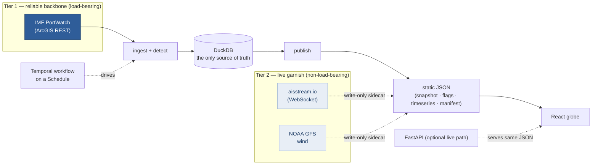

# Standpoint

**World signals on one honest 3D globe. A statistical engine flags ocean-freight disruptions — transit collapses, congestion, Cape-of-Good-Hope reroutes, cargo-specific drops — from free, public IMF PortWatch data; geo-tagged news, storms, hazards and market signals ride alongside as cited, possibly-related context. Every figure is computed in Python from source, and we never forecast: the only future-dated values anywhere are a source model's own published output (NOAA GFS wind, the ACP's projected draft), labelled as theirs.** _(Formerly Freight Radar; repo slug + URL keep the old name.)_

[**▶ Live demo**](https://joshs444.github.io/freight-radar/) · [**📊 Data Atlas**](docs/DATA-ATLAS.md) ([PDF](docs/DATA-ATLAS.pdf)) · [**Full feature ledger**](docs/FEATURES.md)

[](https://github.com/joshs444/freight-radar/actions/workflows/ci.yml)
[](https://github.com/joshs444/freight-radar/actions/workflows/deploy.yml)
[](frontend/scripts/check_chat.mjs)
[](LICENSE)


## In 30 seconds

- **What** — a 3D globe, an analytics board, an in-browser SQL console, and a source ledger over one tier-stamped data store: 28 maritime chokepoints, 2,065 ports, cross-domain measured signals, and cited world context.
- **Why it's different** — honesty is enforced by machines, not adjectives: numbers are computed in Python from cited public data, the chat and the briefing can only state what they can cite, and a stale claim in this README fails a test.
- **Verified** — 285 deterministic backend tests · 82 dbt tests · 833 chat facts grounding-checked, 0 ungrounded (all green, 2026-06-09).
- **Runs itself** — a weekly GitHub Action re-ingests, re-detects, and redeploys the static site; no servers, no API keys in the page.
- **Look around** — [the globe](https://joshs444.github.io/freight-radar/), [the board](https://joshs444.github.io/freight-radar/#v=board), [SQL over the store](https://joshs444.github.io/freight-radar/#v=data), [the source ledger](https://joshs444.github.io/freight-radar/#v=ledger).

**Contents** · [What it is](#what-it-is) · [How it stays honest](#how-it-stays-honest) · [Receipts](#receipts) · [Architecture](#the-one-architectural-seam) · [Stack](#stack) · [Run it](#run-it) · [How this was built](#how-this-was-built) · [Go deeper](#go-deeper)

## What it is

The world's seaborne trade funnels through 28 maritime chokepoints (Suez, Hormuz, Malacca, Panama, the Taiwan Strait…). When one seizes up, the shock ripples through supply chains weeks before it reaches the financial press. Standpoint watches all of them — plus 2,065 ports — runs real change-point detection over the history, and surfaces only the disruptions that clear a statistical bar, with cited world context layered around them.

| A real detected flag | Replay the history |
|---|---|
|  |  |

- **Four views, one store** — ◐ **Globe** (MapLibre v5 + deck.gl: chokepoints, traffic-sized ports, an AIS sample, lane arcs, context layers), ▦ **Board** (a dense, sortable table over the same data — now/normal/Δ%/z/trend/cargo mix), ⌗ **SQL** (a DuckDB-WASM console: real SQL over the published store, in the browser, no backend), § **Sources** (the registry catalog rendered as a human-readable provenance ledger).
- **Statistical detection, not threshold alarms** — STL residual → rolling z **and** CUSUM **and** a `ruptures` PELT breakpoint gate, FDR-controlled, cargo-aware (a port's dominant cargo stream is detected on its own), national-dependence-weighted, holiday-aware, with an explicit flag lifecycle (`new → ongoing → escalated → resolved`).
- **Global Ocean Freight Stress Index + 2019→now history** — a decomposable 0–100 blend of breadth (economic-weighted mean deviation) and depth (the single worst chokepoint) in the top bar, and a History mode that replays the full PortWatch record with the real shocks marked (COVID, Ever Given, the Red Sea crisis).
- **Cross-domain Signal Board** — freight-mode rates (truckload/rail/air), inventories, commodities, metals, macro, labor: z-scores *we* compute over cited public indices, FDR-controlled, association only — beside the port flags, so the product reads multi-domain, not straits-only.
- **Trace, the one provenance primitive** — click any datapoint → its raw input → the computation we ran → the published number → the cited source (linked, licensed, dated). Rendered identically on flags, signals, context dots, and the brief.
- **Grounded chat · read-only MCP server · gated briefing** — "Ask Standpoint" runs entirely in the browser and only states numbers it can trace to a source file (enforced in CI); agents read the same store over MCP (`list_layers` / `get_layer_facts` / `nearby` / `verify` — no write tool, asserted at import); the weekly DERIVED briefing ships only through a fail-closed gate (every number entailed by its citations, zero forecast/causal language, a bait battery that must refuse).
- **Cited context ring** — geo-tagged GDELT news, live NHC + GDACS storms, an animated GFS wind field, NASA GIBS satellite, USGS quakes, official hazard alerts: possibly-related context, structurally unable to touch the fact tables.
- **Business exposure** — point a trade CSV at it; each disruption maps to *your* lanes with a banded cost-of-disruption stack, coverage reporting, and a "show your work" method panel.

The full inventory, in depth: **[docs/FEATURES.md](docs/FEATURES.md)**.

## How it stays honest

Enforced in the UI and in CI, not just stated here:

- **Never called "live."** PortWatch is daily-granularity, refreshed weekly by the IMF. Every tile shows its source and the data's own `as of <date>`; the value is the auto-flagging + attribution, not refresh speed.
- **No model is in the number path.** Every figure is computed in Python from source. Prose is deterministic-template — and the one model-shaped artifact, the DERIVED briefing, is fail-closed-gated so an ungrounded number cannot ship.
- **The chat states nothing it can't cite.** Each answer records the raw values it used and the source file each came from; CI runs the engine over a question battery and fails on any ungrounded fact.
- **Measured vs context is a hard fence.** Measured layers carry a metric we compute and own. Context layers (news, storms, quakes…) are cited as published, labelled "possibly related — never a stated cause," and ride a sidecar registry that structurally cannot write to the fact tables.
- **Detectors that decline to fire.** The Cape-reroute detector stays silent without a real Red-Sea/Cape divergence — and says so. Holiday dips are suppressed. The stress index decomposes into published components, not a black box.
- **The ETL fails loud — Write-Audit-Publish.** Fresh pulls land in staging, a data-quality suite audits them, and only a clean verdict swaps atomically into the live tables with a recorded `lineage_run_id`. Bad upstream data leaves prod exactly unchanged.
- **Receipts are tested.** [`backend/tests/test_readme_receipts.py`](backend/tests/test_readme_receipts.py) fails CI if this README rots: retired stale claims cannot reappear, point-in-time figures must carry their date, and stated counts are checked against the code where cheap.

## Receipts

Re-derived, not asserted — every receipt names its date:

- **285 deterministic backend tests** passing, 0 failures (`pytest -m "not live"`, run 2026-06-09): detection, cargo-aware, ETL guards, WAP, Temporal durability, narrative, MCP read-only, the honesty suite — including this README's own receipts test.
- **Chat grounding** — 833 facts across 39 questions, 0 ungrounded; 6/6 adversarial bait questions refused (run 2026-06-09).
- **dbt** — 10 models, **82 data tests**, hermetic-fixture CI; reconciled to the Python pipeline exactly: stress index max |Δ| = 0 across all 120 daily points (2026-06-16 refresh: 44.3 / "high", data through 2026-06-14).
- **Published store** (2026-06-16 refresh, data through 2026-06-14) — 28 chokepoints + 2,065 ports in the snapshot; 208 flags on the rail.
- **Build-moment receipts** (initial-backfill row counts, prod guard dispatches, headless-Chrome frontend runs) are kept, dated, in [docs/FEATURES.md](docs/FEATURES.md#build-time-verification-receipts).

## The one architectural seam

The app reads from **local DuckDB tables only** — never from any upstream directly.



- **Tier 1 — reliable backbone (load-bearing):** IMF PortWatch. All flags + severity are computed off this tier.
- **Tier 2 — live garnish (non-load-bearing):** aisstream vessel positions + NOAA GFS wind, write-only sidecars the flag engine ignores; they degrade to absent on failure.

DuckDB is a substrate, not a private app store: a co-equal **dbt project** (`dbt/`) re-expresses the transforms as a `raw → staging → marts` lineage with the ETL guards as dbt tests, reconciled to the Python numbers exactly — see [docs/FEATURES.md](docs/FEATURES.md#dbt-analytics-layer-dbt).

## Stack

| Layer | Choice |
|---|---|
| Ingest | Python 3.12, `httpx` async, verified ArcGIS queries with `resultOffset` pagination |
| Storage / detection substrate | **DuckDB** (single file; window functions for rolling baselines) |
| Analytics layer | **dbt** (`dbt-core` + `dbt-duckdb`) — guards as tests, hermetic-fixture CI, exact Python parity |
| Detection | `statsmodels` STL → rolling z, CUSUM, `ruptures` PELT gate; FDR-controlled; cargo-aware + avg-vessel-size axis; national-dependence severity |
| Orchestration | **Temporal** (`temporalio`) — one durable workflow, RetryPolicy, a Schedule, a dedup ledger |
| API / agents | FastAPI read-only with ETags · a read-only **MCP server** over the published store |
| Frontend | **React + Vite + TypeScript** (strict), **MapLibre GL v5 globe**, **deck.gl v9** interleaved, **DuckDB-WASM** SQL console, client-side grounded chat |
| Deploy | GitHub Pages (static, weekly self-refresh via Actions) · docker-compose for the full Temporal loop |

## Run it

```bash
# Backend
cd backend
uv venv --python 3.12 .venv && source .venv/bin/activate
uv pip install -e .
python -m freight_radar.backfill            # 180-day PortWatch backfill -> data/freight_radar.duckdb
python -m freight_radar.publish             # detect + snapshot + manifest -> frontend/public/data/
python -m freight_radar.export_timeseries   # the scrubber's per-day series
pytest -m "not live"                        # the deterministic suite (285 tests as of 2026-06-09)
pytest -m live                              # + live PortWatch contract tests (network)

# Frontend
cd frontend
npm install
npm run dev          # http://localhost:5173
npm run build        # static bundle -> dist/  (deploy anywhere)
npm run test:chat    # honesty test: every chat fact must trace to a source sidecar

# Full durable loop (Docker)
docker compose up    # temporal + worker + schedule-init + api + frontend
# Temporal Web UI: http://localhost:8233 · app: http://localhost:8080 · api: http://localhost:8000
```

Kill the worker mid-run and restart it — Temporal re-drives the in-flight workflow from its last completed activity. dbt commands live in [docs/FEATURES.md](docs/FEATURES.md#dbt-analytics-layer-dbt).

## How this was built

Standpoint is an AI-orchestrated build: multi-agent workflows did the bulk of the implementation, with planning, adversarial-review, and verification passes between waves — the working method is documented in [docs/plans/EXECUTION-PLAYBOOK.md](docs/plans/EXECUTION-PLAYBOOK.md). The architecture decisions are human-owned and recorded as [ADRs](docs/adr/). The trust model deliberately does not depend on who typed the code: every claim class has a machine gate in CI — chat grounding, golden-master sidecars, dbt↔Python parity, the briefing's fail-closed gate, and this README's own receipts test.

## Go deeper

- [**docs/FEATURES.md**](docs/FEATURES.md) — the full feature ledger, in depth.
- [**docs/DATA-ATLAS.md**](docs/DATA-ATLAS.md) — every data source: tier, license, cadence, what we compute from it.
- [**docs/adr/**](docs/adr/) — the architecture decision records.
- [**docs/plans/**](docs/plans/) — the wave-by-wave build plans, kept for provenance (the shipped waves — including [BEST-IN-CLASS-PLAN.md](docs/plans/BEST-IN-CLASS-PLAN.md) and [MONITOR-UX-PLAN.md](docs/plans/MONITOR-UX-PLAN.md) — are done + deployed).
- [**docs/plans/STANDPOINT-VISION.md**](docs/plans/STANDPOINT-VISION.md) — the forward vision: from a freight globe to an honest world-awareness platform, one shippable phase at a time.

Data: [IMF PortWatch](https://portwatch.imf.org/) (CC BY 4.0). Basemap © OpenStreetMap © CARTO.
