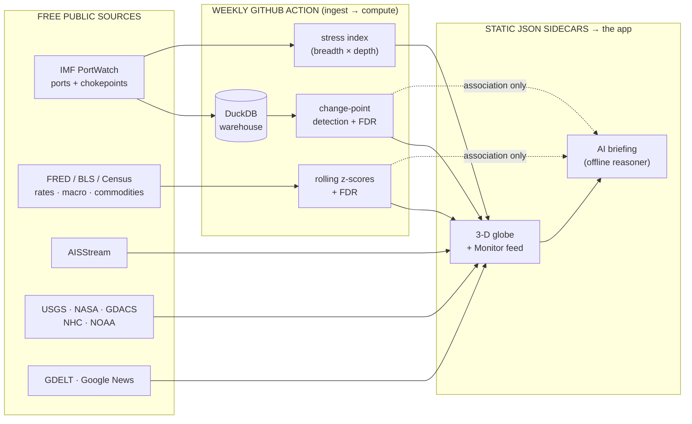

# Standpoint — The Data Atlas

> **Every free, public data source behind the globe — what we take from each, and how they connect into one honest world-model.**
> Companion to the [live demo](https://joshs444.github.io/freight-radar/) and the [Source Ledger](https://joshs444.github.io/freight-radar/#v=ledger) (the same registry, in the app). The full backlog of *candidate* sources lives in [plans/DATA-SOURCES.md](plans/DATA-SOURCES.md).

---

## The thesis — in one paragraph

Standpoint takes **only free, public data** — keyless or free-key, never a metered or paid feed — and assembles it into a single 3-D globe of world situational awareness. One domain is the **measured spine** (ocean freight, daily and per-entity, where we run real change-point detection). Everything else is either a **measured signal** (a national index where *we* compute the anomaly) or **cited context** (someone else's number shown as-is, possibly-related, never a stated cause). An offline AI reads the published result and **connects** the measured facts to the cited context — as association only, never causation, never a forecast. The honesty boundary isn't a promise; it's a compile-time fact (a static import-graph firewall that forbids a context layer from ever writing a measured number).

**34 live layers today** — `11 spine · 8 signal · 14 context · 1 derived` — every one free and cited.

---

## How it connects — the pipeline

No live API at runtime: the weekly Action rebuilds the DuckDB warehouse from source, computes every number in Python, and publishes static JSON. The site is just files — fast, free to host, and impossible to silently change.

---

## The three tiers — who owns the number

| Tier | Meaning | Example |
|---|---|---|
| **SPINE** *(measured)* | The deep, daily, per-entity domain we run real detection on. The flags come from here. | `flags`, `stress` from IMF PortWatch |
| **SIGNAL** *(measured)* | A national index where **we** compute the anomaly (a 12-month rolling z-score), FDR-controlled. | `freight_rate` (truckload +4.8σ), `slack` |
| **CONTEXT** *(cited)* | Someone else's number, shown exactly as published — possibly-related, never a stated cause. | `quakes`, `news_geo`, `wind` |
| **DERIVED** *(AI)* | An offline reasoner's prose over the cited store — every claim traces to a layer. | `ai_briefing` |

Promotion `context → measured` is gated: we only "own" a number when we compute a defensible statistic over raw observed inputs in Python.

---

## The data sources, by category

### 1 · Ocean freight — the measured spine
The one domain with free, daily, per-entity granularity good enough for real change-point detection. Everything in this block is computed from **IMF PortWatch** (AIS-derived, keyless, refreshed weekly).

| Layer(s) | What we take | Cadence | License | Role |
|---|---|---|---|---|
| **IMF PortWatch — ports** → `snapshot` `ports` `timeseries` | Daily port-call counts + capacity for ~2,000 ports, by cargo type. We compute STL deseasonalization → 28-day rolling z → PELT change-point → a gated flag. | daily (weekly refresh) | PortWatch terms (free) | spine |
| **IMF PortWatch — chokepoints** → `chokepoints` `flags` | Daily transit calls for 28 maritime chokepoints by vessel type (container / dry-bulk / tanker / ro-ro) + capacity DWT. | daily (weekly refresh) | PortWatch terms (free) | spine |
| *(derived from the above)* `stress` | Global Ocean Freight Stress Index 0–100 = economic-weighted breadth × worst-chokepoint depth. | weekly | — (computed) | spine |
| *(derived)* `lanes` `world` `events` `brief` | Great-circle lanes, world daily totals, lifecycle events, the templated weekly brief. | weekly | — (computed) | spine |
| **AISStream** → `ships` | A point-in-time sample of live vessel positions near the chokepoints (observed, **not** all ships). | live sample | AISStream terms (free-key) | context |
| **Panama Canal Authority** → `gatun` | Gatún lake level → percentile → minimum projected Neopanamax draft (ft). | ~weekly | ACP terms (free) | signal |

### 2 · Freight cost & macro — measured signals
The cross-domain layer surfaced in the **Signal Board**: trucking, rail, air, inventories, employment. All free **FRED** public-domain series; the number we own is each one's 12-month rolling z-score (FDR-controlled).

| Family (layer) | Series we take | Cadence | License | Role |
|---|---|---|---|---|
| **Freight rates** `freight_rate` | Truckload · Rail line-haul · Deep-sea · Air · Warehousing PPI · Freight Transportation Services Index | monthly | public domain (BLS PPI) | signal |
| **Macro / activity** `macro` | Industrial Production · Manufacturing Production · Rail Freight Carloads · Truck Tonnage · Motor Vehicle Production | monthly | public domain (Fed / BTS) | signal |
| **Inventory slack** `slack` | Inventories-to-sales: total business · retail · wholesale · manufacturing · auto | monthly | public domain (Census / BEA) | signal |
| **Transport labor** `labor` | Transportation & warehousing · trade-transport-utilities · truck-transportation · manufacturing employment | monthly | public domain (BLS CES) | signal |

### 3 · Commodities & metals — measured signals
The cargo that moves through the chokepoints, priced. Free **FRED** (IMF Primary Commodity Prices); we own the z-score anomaly, the price stays cited.

| Family (layer) | Series we take | Cadence | License | Role |
|---|---|---|---|---|
| **Commodities** `commodities` | Brent crude · EU natural gas · Wheat · Maize (corn) · Soybeans | monthly | public domain (IMF PCPS via FRED) | signal |
| **Metals & bulk energy** `metals` | Aluminum · Iron ore · Nickel · Zinc · Lead · Tin · Copper · Australian coal · Energy Index | monthly | public domain (IMF PCPS via FRED) | signal |

### 4 · Water, canal & marine — context
Physical conditions at the maritime constraints.

| Source → layer | What we take | Cadence | License | Role |
|---|---|---|---|---|
| **NOAA CO-OPS** → `tides` | Observed water level at major US ports. | sub-daily | public domain | context |
| **USGS Water Services** → `streamflow` | Observed river stage on freight-relevant rivers. | sub-daily | public domain | context |
| **Open-Meteo (marine)** → `marine` | Model wave height at the chokepoints. | hourly model | CC-BY 4.0 | context |

### 5 · Weather & storms — context
Active weather that can physically slow a route — attached to a flag only when contemporaneous, **never** as a stated cause.

| Source → layer | What we take | Cadence | License | Role |
|---|---|---|---|---|
| **NHC** → `weather` | Active US tropical-cyclone cones (Atlantic + E/Central Pacific). | per-advisory | public domain | context |
| **GDACS** → `weather` `disruptions` | Every-other-basin cyclones + global flood/quake/cyclone alerts that hit a monitored port. | event-driven | GDACS terms (free) | context |
| **NOAA GFS** → `wind` | Global 10 m wind field, now → +4 days, baked to small PNGs. | weekly (f000–f096) | public domain | context |
| **NASA GIBS (VIIRS)** → `satellite` | True-color satellite imagery tiles. | daily | public domain | context |

### 6 · Earth hazards & events — context
The "what else is happening on Earth near a place" ring.

| Source → layer | What we take | Cadence | License | Role |
|---|---|---|---|---|
| **USGS** → `quakes` | Recent earthquakes (geo + magnitude). | real-time | public domain | context |
| **NASA EONET** → `eonet` | Natural events: fire / volcano / storm / ice. | daily | public domain | context |
| **NOAA SWPC** → `space_weather` | Geomagnetic indices (Kp / solar). | sub-daily | public domain | context |

### 7 · World news — context
Geo-located world news near the chain, and per-flag corroborating headlines.

| Source → layer | What we take | Cadence | License | Role |
|---|---|---|---|---|
| **GDELT 2.0 GKG** → `news_geo` | One dot per geo-tagged business/disruption article, by topic. | 15-min export | GDELT terms (free) | context |
| **Google News RSS** → `news` | Per-flag curated headlines (linked in the brief's connection lines). | per-refresh | Google News terms | context |

### 8 · Markets — context
| Source → layer | What we take | Cadence | License | Role |
|---|---|---|---|---|
| **FRED + Stooq** → `market` | Cited market indicators shown as published, never restated as ours. | daily | public domain (FRED) / Stooq terms | context |

### 9 · Derived — the AI layer
| Layer | What it is | Role |
|---|---|---|
| `ai_briefing` | An **offline** reasoner (Claude Code, zero runtime cost) reads the published store, grounds every claim through `verify()`, connects measured facts to cited context as association, and is gate-checked fail-closed before it ships. | derived |

---

## How the layers connect — the wiring

1. **The spine generates the flags.** Only PortWatch has the daily per-entity depth to support change-point detection, so the *alerts* come from maritime. (This is why the straits dominate — by data availability, not by choice.)
2. **The signals ride alongside.** The FRED families (freight rate, macro, slack, labor, commodities, metals) are national + monthly — too coarse for per-entity detection, but each yields an FDR-controlled z-score, surfaced in the **Signal Board** next to the flags. "Truckload freight rate +4.8σ" sits beside "Strait of Hormuz −92%."
3. **Context corroborates, never creates.** A storm or quake can attach to a flag when it co-occurs in space + time, but it can never *raise* a flag and is never written as a cause. The import-graph firewall makes that a compile error.
4. **The AI connects them.** The offline briefing joins a measured disruption to its co-occurring cited news / hazards — "Hormuz −92% co-occurs with 4 cited reports (NPR, CNBC, NYT)" — labelled association, gate-verified.

---

## Gaps & candidates — what to add next, what's missing

The full scouted backlog (93 sources, tagged by tier / auth / cadence / license) is in **[plans/DATA-SOURCES.md](plans/DATA-SOURCES.md)**. The highest-value **free, unshipped** candidates:

| Candidate | Why it matters | Tier it would be | Catch |
|---|---|---|---|
| **USACE LPMS (lock performance)** | Near-real-time US inland-waterway lock transits + delay minutes — the one *non-maritime* source with PortWatch-like granularity. | measured (signal/spine) | keyless, but US-only |
| **US Census Intl Trade API** | Monthly value + weight by US port & HS code → owned YoY / trend-deviation per port. | measured | free-key, ~5-week lag |
| **OECD CLI / Eurostat / UN Comtrade** | National leading indicators, EU PPI + trade, bilateral flows → more macro signals. | measured | monthly/quarterly, coarse |
| **MarineCadastre (NOAA/BOEM)** | Annual AIS transit-count raster per US grid cell → owned corridor density delta. | measured | annual cadence |
| **EIA energy** | US energy stocks / flows → an energy-logistics signal. | measured | free-key |

**The structural gap — and why it's honest, not a flaw:** the things people most want at *line level* (per-lane truckload rates, container spot rates) only exist as **commercial** feeds — DAT, FreightWaves SONAR, Drewry WCI, Freightos FBX. Pulling them in would break the zero-marginal-cost rule and turn an owned-statistic product into a reseller of someone else's benchmark. So Standpoint stays honest about its shape:

> **Maritime is the deep measured spine (daily, per-entity). Every other domain is a measured national signal or cited context — broad, but not line-level — because that's the granularity free public data actually offers.**

That boundary is the story: not "we have everything," but "we have everything *free*, we're explicit about how deep each layer goes, and we never pretend a context number is a measured one."

---

_Generated from the live layer registry (`backend/freight_radar/registry/`) — the same source of truth the app's [Source Ledger](https://joshs444.github.io/freight-radar/#v=ledger) renders. To regenerate the PDF: `python docs/build_atlas_pdf.py`._
